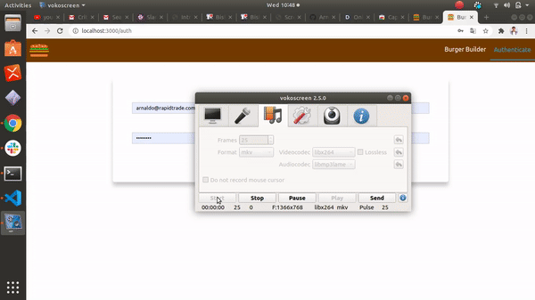
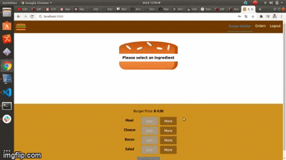
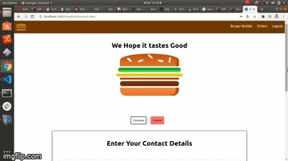

# ReactJS Burger Builder

## Instalation 
After cloning the repository install the node modules
    `` yarn install `` 
## Setup 
Create a .env file in the Project's root directory and add and environment variable for your firebase database url , Sign In URL , Sign Up URL
NB : make sure to prefix the name of your environment variable with REACT_APP_<url-name>  
ie:
`` REACT_APP_ORDERS_URL=https://firebase.com/*******``
`` REACT_APP_SIGNUP_URL=https://firebase.com/*******``
## Run the Applcation
``sh yarn start ``

### A live Deployment of the Application can be seen by visting the link below:
`` https://burgerbuilder.co ``

## Application Usage 
### Authenticate 
##### sign in or sign up if you dont alreay have an Account

##### select the ingredient you would like in your Brger

##### Fill in form Details

##### View your Order history on the Orders screen
